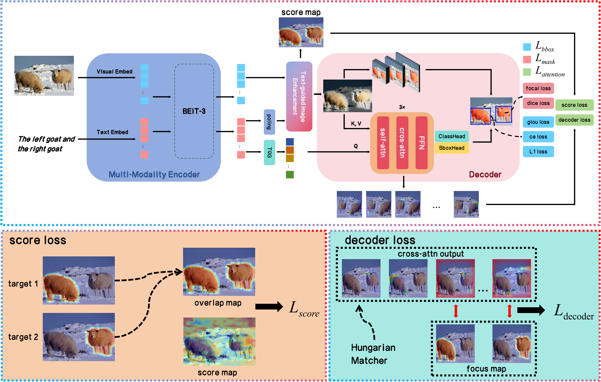

# ALVG


## Abstract
Visual grounding is the task of locating the relevant region in an image based on a textual description. Most existing methods rely on pre-trained visual and text encoders to extract features from images and text, which are fed into a fusion module to obtain fused features. To obtain high-quality fused features, researchers often design various complex multi-modal fusion modules. These fused features are processed using an encoder-decoder architecture to produce the final output. However, in the training process, the optimization objective is typically centered around the final predicted outputs, such as bounding boxes or instance segmentation masks, while the quality of the fused features often receives less direct attention. Therefore, the gradient usually needs to traverse a relatively long path when being backpropagated to the multi-modal fusion module, leading to diminished optimization effectiveness. In this paper, we propose ALVG, a simple and efficient visual grounding framework. We design a novel loss function to directly supervise the attention mechanism, along with a simple but effective text-guided image enhancement module to complement it. The enhanced features are directly used for instance segmentation tasks, as well as object detection tasks. Experiments on six widely used Visual Grounding (VG) datasets, including RefCOCO/+/g, ReferIt, Flickr30K, and GRefCOCO, demonstrate the superiority of ALVG. Our method not only improves efficiency and convergence speed but also achieves state-of-the-art performance on these benchmarks.


## FrameWork


<!--    -->
  


## Installation
CUDA=11.8
torch=2.0.0
torchvision=0.15.0

### Prerequisites

```
pip install -r requirements.txt
```
Our code depends on parts of [detrex](https://detrex.readthedocs.io/en/latest/tutorials/Installation.html) and [detectron2](https://github.com/facebookresearch/detectron2), so you need to install and compile them.
```
python -m pip install 'git+https://github.com/facebookresearch/detectron2.git'
git clone https://github.com/IDEA-Research/detrex.git
cd detrex
git submodule init
git submodule update
pip install -e .
```
Then install ALVG package in editable mode:
```
pip install -e .
```

### Data Preparation

For the construction of the dataset that support REC tasks, please refer to the [SimVG](https://github.com/Dmmm1997/SimVG) repository. For the construction of the dataset that support both REC and RES tasks we haven't released these yet, out of the review strategy. 


The data structure should look like the following:
```
| -- data
| -- annotations
    | -- flickr30k
    | -- referitgame-berkeley
    | -- refcoco-unc
    | -- refcocoplus-unc
    | -- refcocog-umd
    | -- refcocog-google
    | -- grefcoco
        | -- instances.json
    | -- mixed
| -- images
    | -- mscoco
    | -- saiaprtc12
    | -- flickr30k
    | -- visual-genome
```

### Pre-trained Weights

The pre-trained BEiT-3 weights can be downloaded from [this link](https://github.com/microsoft/unilm/blob/master/beit3/README.md#download-checkpoints). Additionally, you will need to download the [tokenizer](https://github.com/microsoft/unilm/blob/master/beit3/README.md#text-tokenizer) for BEiT-3.

First, create a directory for the pre-trained weights:

```
mkdir pretrain_weights
```
Place the BEiT checkpoints and tokenizer within this directory.

The final directory structure of ALVG should resemble the following:
```
ALVG
├── alvg
├── configs
├── data
├── docs
├── pretrain_weights
└── tools
```

## Training
```
python tools/train.py --config configs/single/ViT-base/[DATASET_NAME]/[DATASET_NAME].py
```
```
bash tools/dist_train.sh configs/mix/ViT-large/pretrian-mixed.py 8
```

## Testing
```
python tools/test.py --config configs/single/ViT-base/[DATASET_NAME]/[DATASET_NAME].py --load-from <pth>
```

## Acknowledgements
This codebase is partially based on [SimVG](https://github.com/Dmmm1997/SimVG)

